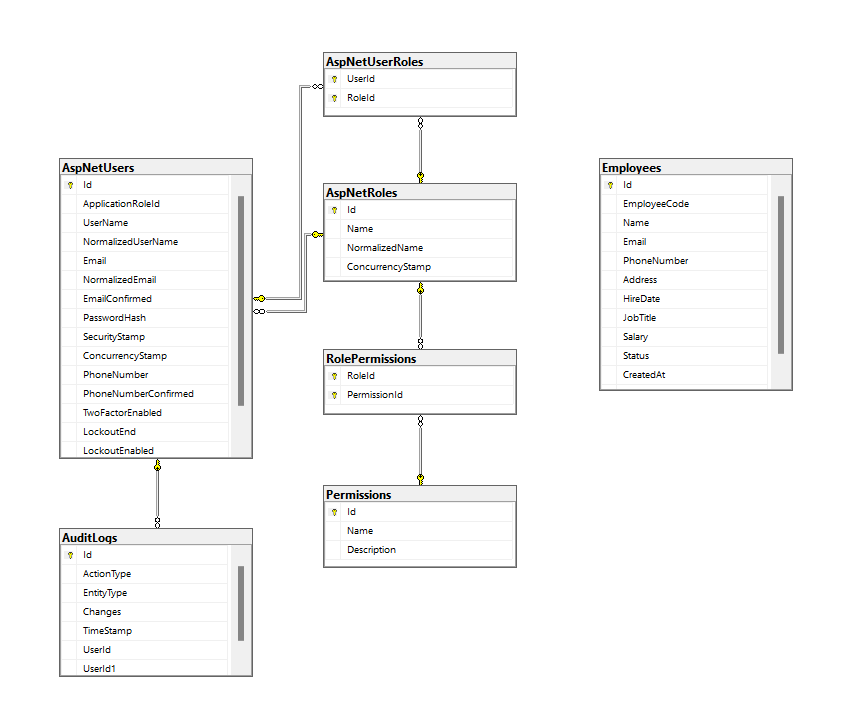

# Employee Management System

An advanced **Employee Management System** built with **C# .NET** using **Entity Framework**. This system provides a comprehensive solution for managing employees, roles, permissions, and audit logs while ensuring robust security through **JWT authentication** and **role-based authorization**.

## 📌 Features

### ✅ Core Functionalities
- Add, Update, Retrieve, and Delete Employees
- Dynamic Role and Permission Management
- User Authentication with JWT Tokens
- Role-Based Authorization

### ✅ System Design & Best Practices
- Follows the **Unit of Work** pattern
- Implements structured **audit logging**
- Uses **repositories** and **interfaces** for data management
- Input validation and duplicate checks

### ✅ Security
- JWT-based authentication
- Secure and flexible role and permission management

### ✅ API Documentation
- Provides clear and interactive API documentation via **Swagger UI** or **Postman**

## 🗂️ Project Structure

```
├── Controllers/               # API Controllers
├── Data/                      # Database Context & Migrations
├── Models/                    # Entity Models (Employee, Role, Permission, etc.)
├── Repositories/              # Repository Interfaces & Implementations
├── Services/                  # Business Logic
├── DTOs/                      # Data Transfer Objects
├── Middleware/                # Custom Middleware (e.g., Audit Logging)
└── Program.cs                 # Entry Point
```

## 🛠️ Technologies Used

- **C# .NET Core**
- **Entity Framework Core**
- **PostgreSQL** (Database)
- **JWT Authentication**
- **Swagger UI** (API Documentation)
- **Git** (Version Control)

## 📊 Database Schema

Includes tables for:

- `Employees`
- `Users` (based on `ApplicationUser` inheriting from `IdentityUser`)
- `Roles`
- `Permissions`
- `RolePermissions`
- `AuditLogs`

### 🗺️ Entity Relationship Diagram (ERD)



## 🚀 Getting Started

### Prerequisites

- .NET Core SDK
- PostgreSQL Database

### Setup Instructions

1. **Clone the repository:**

   ```bash
   git clone https://github.com/your-username/employee-management-system.git
   cd employee-management-system
   ```

2. **Configure Database:**

   Update `appsettings.json` with your PostgreSQL connection string:

   ```json
   "ConnectionStrings": {
      "DefaultConnection": "Host=localhost;Port=5432;Database=EmployeeDB;Username=your-username;Password=your-password;"
   }
   ```

3. **Apply Migrations:**

   ```bash
   dotnet ef database update
   ```

4. **Run the Application:**

   ```bash
   dotnet run
   ```

5. **Access API Documentation:**

   Open `http://localhost:5000/swagger` in your browser.

## 🔍 Example API Endpoints

### User Authentication

- **Register User:** `POST /api/auth/register`
- **Login:** `POST /api/auth/login`

### Employee Management

- **Get All Employees:** `GET /api/employees`
- **Create Employee:** `POST /api/employees`
- **Update Employee:** `PUT /api/employees/{id}`
- **Delete Employee:** `DELETE /api/employees/{id}`

### Role & Permission Management

- **Create Role:** `POST /api/roles`
- **Assign Permission to Role:** `POST /api/rolepermissions`


